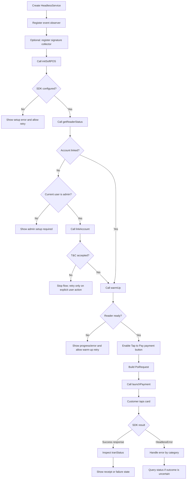

# MineSec Headless iOS SDK Customer API Guide
This guide is for app developers integrating the MineSec Headless iOS SDK. It covers the public SDK APIs intended for host app usage, the recommended Tap to Pay on iPhone setup flow, reader warm-up, payment launch, follow-up actions, and error handling.

## History
### v1.2.01
* change `getReaderStatus()` to always return the latest known `HeadlessReaderStatus`
* treat Tap to Pay account status refresh errors as best-effort status refresh failures instead of API failures
* keep detailed operation errors on action APIs such as `initSoftPOS()`, `linkAccount()`, `warmUp()`, and `launchPayment(_:)`

### v1.2.00
* introduce new API structure
* add performance log

### v1.1.00
* sdk  support you to setup apple token parameters: mbn, mid. mcc and terminal profile Id
* sdk supports to do PIN Entry
* sdk supports to do PIN Bypass
* sdk supports to do SCA Pin entry
* sdk fixed an issue:  sometimes the transaction fails due to iOS reader not ready. after fix: SDK will do auto re-provision when reader is not ready
* update the demo application to make content well structured.


## Overview

The Headless iOS SDK lets a host app accept Tap to Pay on iPhone payments through a small Swift API surface. The host app owns the UI, user journey, admin/staff permissions, amount entry, receipt handling, and transaction state display. The SDK owns MineSec configuration, Apple reader account linking, reader session warm-up, card read orchestration, and transaction submission.

Primary integration object:

```swift
let service = HeadlessService()
```

Keep one `HeadlessService` instance alive for the payment screen or payment flow. The service is an actor, so SDK methods are called with `await`.

## Requirements

- A physical iPhone that supports Tap to Pay on iPhone.
- Apple Tap to Pay / `ProximityReader` entitlement configured for the host app.
- A MineSec license file bundled in the host app target.
- MineSec profile id and merchant configuration provided by MineSec.
- Network connectivity to the configured MineSec environment.

## Public API Summary

### `HeadlessService`

The main SDK entry point.

```swift
public actor HeadlessService {
    public typealias SignatureCollector = (_ tranId: String) async throws -> String
    public var requestSignature: SignatureCollector?
    public let events: AsyncStream<HeadlessReaderEvent>

    public init()

    public func initSoftPOS(
        profileId: String,
        licenseFile: String,
        posConfiguration: POSConfiguration? = nil
    ) async -> Result<HeadlessInitSuccess, HeadlessError>

    public func getReaderStatus() async -> HeadlessReaderStatus

    public func linkAccount() async -> Result<
        HeadlessReaderStatus,
        HeadlessError
    >

    public func warmUp() async -> Result<
        HeadlessReaderStatus,
        HeadlessError
    >

    public func launchPayment(
        _ poiRequest: PoiRequest
    ) async -> Result<TransactionResponse, HeadlessError>

    public func launchRequest(
        _ poiRequest: PoiRequest
    ) async -> Result<TransactionResponse, HeadlessError>

    public func actionVoid(
        tranId: String
    ) async -> Result<TransactionResponse, HeadlessError>

    public func actionLinkedRefund(
        tranId: String,
        amount: Amount? = nil
    ) async -> Result<TransactionResponse, HeadlessError>

    public func actionAuthComp(
        tranId: String,
        amount: Amount? = nil
    ) async -> Result<TransactionResponse, HeadlessError>

    public func actionQuery(
        tranId: String? = nil,
        posReference: String? = nil,
        requestId: String? = nil
    ) async -> Result<TransactionResponse, HeadlessError>

    public func invalidateSession()
}
```

Only the APIs above should be treated as the supported customer integration surface. Internal reader/session helpers such as `ensurePreparedSession()` are not customer APIs.

`launchRequest(_:)` is kept for compatibility. New integrations should use `launchPayment(_:)`.

## Recommended Reader Setup Flow

Version 1.2 separates SDK configuration, Apple Tap to Pay account linking, reader status inspection, reader warm-up, and payment launch.

```text
initSoftPOS()
  // Retry initSoftPOS if SDK configuration fails.

-> getReaderStatus()
  // Use accountStatus and readiness to drive UI.

-> linkAccount() if needed
  // Admin only at the host app layer.
  // If user declines T&C, stop the flow.

-> warmUp()
  // Recommended before enabling payment.
  // May return immediately if warm-up already completed.

-> launchPayment()
  // Uses a warmed session when available.
```

The Tap to Pay payment button should be visible to eligible users according to the host app UX, but it should only be enabled for payment after:

- `warmUp()` succeeds; or
- `getReaderStatus()` returns `accountStatus == .linked` and `readiness == .ready`.

`launchPayment(_:)` has fallback warm-up behavior for safety, but relying on fallback warm-up can be slow and is not the recommended path for meeting Tap to Pay UI responsiveness requirements.

## Reader Status APIs

### `getReaderStatus()`

Use `getReaderStatus()` after `initSoftPOS()`, after foreground changes, after reader events, and before enabling payment UI.

```swift
let status = await service.getReaderStatus()

updateReaderUI(status)
```

`getReaderStatus()` always returns the latest known status. It may refresh Tap to Pay account status as a best-effort operation, but refresh errors are not surfaced from this API. Detailed operation failures are returned by APIs that perform work, such as `initSoftPOS()`, `linkAccount()`, `warmUp()`, and `launchPayment(_:)`.

Status model:

```swift
public enum HeadlessReaderAccountStatus: Sendable, Equatable {
    case unknown
    case notLinked
    case linked
}

public enum HeadlessReaderReadiness: Sendable, Equatable {
    case notReady
    case warmingUp
    case ready
    case failed(String)
}

public struct HeadlessReaderStatus: Sendable, Equatable {
    public let isSupported: Bool
    public let isConfigured: Bool
    public let accountStatus: HeadlessReaderAccountStatus
    public let readiness: HeadlessReaderReadiness
}
```

Recommended UI mapping:

| Status | Suggested UI behavior |
| --- | --- |
| `isSupported == false` | Hide or disable Tap to Pay and explain that a supported iPhone is required. |
| `isConfigured == false` | Call or retry `initSoftPOS()`. |
| `accountStatus == .notLinked` | Show setup action for admin users. Staff users should be told that admin setup is required. |
| `accountStatus == .linked`, `readiness == .notReady` | Call `warmUp()` before enabling payment. |
| `readiness == .warmingUp` | Show setup/progress state and disable duplicate warm-up. |
| `readiness == .ready` | Enable payment. |
| `readiness == .failed(String)` | Show retry warm-up action or setup troubleshooting. |

## Configuration Types

### `POSConfiguration`

Optional POS configuration passed during SDK initialization.

```swift
public struct POSConfiguration: Sendable {
    public let tapToPayReaderConfig: TapToPayReaderConfiguration?

    public init(tapToPayReaderConfig: TapToPayReaderConfiguration?)
}
```

### `TapToPayReaderConfiguration`

Merchant and terminal information used for reader setup.

```swift
public struct TapToPayReaderConfiguration: Sendable {
    public let merchantBusinessName: String?
    public let merchantId: String?
    public let merchantCategoryCode: String?
    public let terminalEmvProfileId: String?
}
```

Current SDK note: the initializer parameter is currently named `meerchantCategoryCode`. Use the current SDK signature at compile time.

Example:

```swift
let config = POSConfiguration(
    tapToPayReaderConfig: TapToPayReaderConfiguration(
        merchantBusinessName: "Merchant Name",
        merchantId: "merchant-id",
        meerchantCategoryCode: "5999",
        terminalEmvProfileId: "terminal-emv-profile-id"
    )
)
```

## Initialization

Call `initSoftPOS(...)` before account linking, warm-up, or payment.

```swift
let initResult = await service.initSoftPOS(
    profileId: "prof_xxx",
    licenseFile: "mineSec-license",
    posConfiguration: config
)

switch initResult {
case .success(let info):
    print("SDK configured:", info.headlessId, info.headlessVersion)
case .failure(let error):
    showInitializationError(error)
}
```

`licenseFile` is the resource name of the MineSec license file in the host app bundle.

Success model:

```swift
public struct HeadlessInitSuccess: Sendable {
    public let headlessId: String
    public let headlessVersion: String
    public let licenseId: String
    public let customerId: String
}
```

Important v1.2 behavior:

- `initSoftPOS(...)` configures the SDK.
- It does not require Tap to Pay account linking.
- It does not guarantee the reader session is ready.
- If the account is already linked, the SDK may start warm-up in the background.
- Always call `getReaderStatus()` or `warmUp()` before enabling payment.

Recommended host app behavior:

- Initialize once when entering the payment/setup flow.
- Retry `initSoftPOS(...)` if SDK configuration fails.
- Show progress while initialization is running.
- Do not expose license details to end users.

## Account Linking

Use `linkAccount()` to run Apple Tap to Pay account linking and T&C acceptance.

```swift
let result = await service.linkAccount()

switch result {
case .success(let status):
    // Account is linked. Warm up before payment.
    await handleLinkedStatus(status)
case .failure(.accountLinkDeclined):
    // User declined T&C. Stop the setup flow.
    showSetupStoppedMessage()
case .failure(let error):
    showLinkAccountError(error)
}
```

Rules:

- Expose `linkAccount()` only to admin users in the host app.
- The SDK does not accept or enforce the host app's admin/staff role.
- If the account is already linked, `linkAccount()` may return success immediately.
- If the user declines T&C, stop the setup flow and retry only when the user explicitly tries again.
- After successful linking, call `warmUp()` if the user may pay immediately.

The SDK does not expose a production `unlinkAccount()` API. If Apple review requires re-accepting T&C for screen recording, use Apple's documented manual unlink flow outside the production SDK API.

## Reader Warm-Up

Use `warmUp()` to prepare the Apple reader session before the user presses the Tap to Pay payment button.

```swift
let result = await service.warmUp()

switch result {
case .success(let status) where
    status.accountStatus == .linked && status.readiness == .ready:
    enablePaymentButton()
case .success(let status):
    updateReaderUI(status)
case .failure(let error):
    showWarmUpError(error)
}
```

When to call `warmUp()`:

- when entering the checkout or payment page;
- after `linkAccount()` succeeds if the user may pay immediately;
- after the app returns from background to foreground while the payment screen is active;
- after cancellation, session invalidation, or reader `notReady` events;
- before enabling the Tap to Pay payment button.

Idempotency:

- If readiness is already `.ready`, `warmUp()` returns success immediately.
- If warm-up is already in progress, `warmUp()` waits for the existing task.
- If warm-up previously failed, the app may call `warmUp()` again.
- The SDK does not run a periodic warm-up timer.

## Reader Events

Observe `service.events` to update UI state during reader setup and card reads.

```swift
Task {
    for await event in service.events {
        await MainActor.run {
            updateReaderUI(event)
        }
    }
}
```

Event values:

```swift
public enum HeadlessReaderEvent: Sendable, Equatable {
    case readyForTap
    case cardDetected
    case pinEntryRequested
    case pinEntryCompleted
    case removeCard
    case readCompleted
    case readCancelled
    case readNotCompleted
    case readRetry
    case notReady
    case progress(Int)
    case uiDismissed
    case unknown(name: String)
}
```

Recommended UI mapping:

| Event | Suggested UI behavior |
| --- | --- |
| `readyForTap` | Show "Ready to tap" state. |
| `cardDetected` | Show "Card detected" or processing state. |
| `pinEntryRequested` | Indicate that PIN entry is required. |
| `pinEntryCompleted` | Return to processing state. |
| `removeCard` | Ask customer to remove the card. |
| `readCompleted` | Show processing state while final result is returned. |
| `readCancelled` | Return to idle state and allow retry. |
| `readNotCompleted` | Ask user to retry tapping the card. |
| `readRetry` | Keep payment active and prompt another tap. |
| `notReady` | Disable payment action, call `getReaderStatus()`, then call `warmUp()` if appropriate. |
| `progress(Int)` | Update progress indicator if shown. |
| `uiDismissed` | Treat as user/system cancellation and allow retry. |
| `unknown(name:)` | Log safely and show a generic processing/idle state. |

Start only one event observer per `HeadlessService` instance.

## Payment Request

Use `PoiRequest` to start a transaction.

```swift
let request = PoiRequest(
    tranType: .sale,
    amount: Amount(value: "10.00", currency: "HKD"),
    profileId: "prof_xxx",
    description: "Order #10001",
    posReference: "order-10001-attempt-1",
    cvmSignatureMode: .signOnPaper
)

let result = await service.launchPayment(request)
```

Use `launchRequest(_:)` only for backwards compatibility with older integrations.

### `PoiRequest`

```swift
public struct PoiRequest: Codable, Sendable {
    public let tranType: TranType
    public let amount: Amount
    public let profileId: String
    public let acptId: String?
    public let primaryTid: String?
    public let description: String?
    public let posReference: String
    public let preferredAcceptanceTag: String?
    public let cvmSignatureMode: CVMSignatureMode
    public let forcePaymentMethod: String?
    public let forceFetchProfile: Bool
    public let tapToOwnDevice: Bool
    public let installmentPlan: Int?
    public let linkedTranId: String?
    public let extra: [String: String]?
}
```

Most integrations only need:

- `tranType`
- `amount`
- `profileId`
- `description`
- `posReference`
- `cvmSignatureMode`
- `linkedTranId` for linked refund card reads

### `Amount`

```swift
public struct Amount: Codable, Sendable {
    public let value: String
    public let currency: String
}
```

Guidance:

- Use a decimal string such as `"10.00"`.
- Use the currency configured for the merchant, such as `"HKD"`.
- Validate amount input in the host app before calling the SDK.

### `TranType`

```swift
public enum TranType: String, Codable, Sendable {
    case sale = "SALE"
    case refund = "REFUND"
    case auth = "AUTH"
    case auth_comp = "AUTH_COMP"
}
```

### `CVMSignatureMode`

```swift
public enum CVMSignatureMode: String, Codable, Sendable {
    case signOnPaper = "SIGN_ON_PAPER"
}
```

## Transaction Response

Successful transaction APIs return `TransactionResponse`.

Important fields:

```swift
public struct TransactionResponse: Codable, Sendable {
    public let tranId: String
    public let tranType: String
    public let tranStatus: String
    public let amount: AmountInfo
    public let paymentMethod: String
    public let entryMode: String
    public let accountMasked: String
    public let accountLast4: String
    public let cvmPerformed: String
    public let profileId: String
    public let acceptanceId: String
    public let posReference: String?
    public let trace: String
    public let rrn: String?
    public let approvalCode: String?
    public let actions: [ActionInfo]
    public let createdAt: String
    public let updatedAt: String?
}
```

Recommended host app behavior:

- Store `tranId`, `tranStatus`, `amount`, `paymentMethod`, `accountMasked`, `rrn`, `approvalCode`, and `posReference` for receipt and support.
- Treat `tranStatus` as the business outcome returned by MineSec.
- Do not infer approval from SDK success alone. SDK success means a transaction response was received; always inspect `tranStatus`.

## Follow-up Actions

### Void

Void an eligible transaction.

```swift
let result = await service.actionVoid(tranId: saleTranId)
```

Use when the original transaction is voidable according to merchant/acquirer rules.

### Linked Refund

Refund an existing transaction.

```swift
let fullRefund = await service.actionLinkedRefund(tranId: saleTranId)

let partialRefund = await service.actionLinkedRefund(
    tranId: saleTranId,
    amount: Amount(value: "1.00", currency: "HKD")
)
```

If `amount` is omitted, the backend may process a full linked refund depending on merchant rules.

### Auth Completion

Complete an authorization.

```swift
let result = await service.actionAuthComp(
    tranId: authTranId,
    amount: Amount(value: "10.00", currency: "HKD")
)
```

### Query

Query transaction status by one of the supported identifiers.

```swift
let byTranId = await service.actionQuery(tranId: tranId)
let byPosReference = await service.actionQuery(posReference: posReference)
let byRequestId = await service.actionQuery(requestId: requestId)
```

At least one identifier is required.

Recommended usage:

- Query after uncertain failures before retrying a payment or follow-up action.
- Query by `posReference` when the host app did not receive or persist `tranId`.
- Query by `tranId` when it is available.

## Signature Collection

If signature is required, the SDK can call a host-provided signature collector.

```swift
service.requestSignature = { tranId in
    let base64Signature = try await presentSignatureCaptureScreen(tranId: tranId)
    return base64Signature
}
```

The returned string should be a Base64-encoded image payload accepted by MineSec.

Recommended behavior:

- Register the signature collector before starting a transaction.
- Keep the signature UI simple and blocking until the customer confirms or cancels.
- If signature collection fails, show a clear follow-up message and check transaction status.

## Cancel or Reset Reader Session

Use `invalidateSession()` when the host app needs to cancel or reset the active reader session.

```swift
await service.invalidateSession()
```

Typical use cases:

- User taps a cancel button.
- Payment screen is dismissed.
- App needs to reset a stale reader session.
- Reader event indicates `notReady`.

After invalidation, call `getReaderStatus()` and then `warmUp()` before enabling payment again.

## Recommended Flow



## Typical Swift Integration

```swift
final class PaymentViewModel: ObservableObject {
    private let service = HeadlessService()

    @Published private(set) var readerStatus: HeadlessReaderStatus?
    @Published private(set) var paymentEnabled = false

    func setup(currentUserIsAdmin: Bool) async {
        Task {
            for await event in service.events {
                await MainActor.run {
                    self.handleReaderEvent(event)
                }

                if event == .notReady {
                    await self.refreshAndWarmUpIfNeeded()
                }
            }
        }

        service.requestSignature = { tranId in
            try await self.collectSignature(tranId: tranId)
        }

        let initResult = await service.initSoftPOS(
            profileId: "prof_xxx",
            licenseFile: "mineSec-license",
            posConfiguration: nil
        )

        guard case .success = initResult else {
            if case .failure(let error) = initResult {
                await MainActor.run { self.showError(error) }
            }
            return
        }

        let status = await refreshReaderStatus()

        if status.accountStatus == .notLinked {
            guard currentUserIsAdmin else {
                await MainActor.run { self.showAdminSetupRequired() }
                return
            }

            let linkResult = await service.linkAccount()
            switch linkResult {
            case .success:
                break
            case .failure(.accountLinkDeclined):
                await MainActor.run { self.showSetupStoppedMessage() }
                return
            case .failure(let error):
                await MainActor.run { self.showError(error) }
                return
            }
        }

        await warmUpAndEnablePaymentIfReady()
    }

    func appBecameActive() async {
        await refreshAndWarmUpIfNeeded()
    }

    private func refreshReaderStatus() async -> HeadlessReaderStatus {
        let status = await service.getReaderStatus()

        await MainActor.run {
            self.readerStatus = status
            self.paymentEnabled =
                status.accountStatus == .linked &&
                status.readiness == .ready
        }
        return status
    }

    private func refreshAndWarmUpIfNeeded() async {
        let status = await refreshReaderStatus()
        guard status.accountStatus == .linked else { return }
        guard status.readiness != .ready else { return }

        await warmUpAndEnablePaymentIfReady()
    }

    private func warmUpAndEnablePaymentIfReady() async {
        let result = await service.warmUp()

        switch result {
        case .success(let status):
            await MainActor.run {
                self.readerStatus = status
                self.paymentEnabled =
                    status.accountStatus == .linked &&
                    status.readiness == .ready
            }
        case .failure(let error):
            await MainActor.run {
                self.paymentEnabled = false
                self.showError(error)
            }
        }
    }

    func pay(amount: String, currency: String, orderId: String) async {
        guard paymentEnabled else {
            await warmUpAndEnablePaymentIfReady()
            guard paymentEnabled else { return }
        }

        let request = PoiRequest(
            tranType: .sale,
            amount: Amount(value: amount, currency: currency),
            profileId: "prof_xxx",
            description: "Order \(orderId)",
            posReference: orderId,
            cvmSignatureMode: .signOnPaper
        )

        let result = await service.launchPayment(request)

        switch result {
        case .success(let response):
            handleTransactionResponse(response)
        case .failure(let error):
            handlePaymentError(error, posReference: orderId)
        }
    }
}
```

Adjust actor/MainActor boundaries according to the architecture of the host app.

## Existing User Awareness and Merchant Education

Apple review may require the host app to demonstrate that existing users can see Tap to Pay on iPhone availability before accepting T&C, receive merchant education after accepting T&C, and find merchant education later.

This is primarily a host app UX requirement, not an SDK API requirement.

Recommended host app behavior:

- Show a Tap to Pay on iPhone awareness modal, banner, or setup entry for existing users after login or app update.
- Keep the Tap to Pay payment acceptance button visible to eligible users before T&C is accepted, but disable payment until setup and warm-up are complete.
- After `linkAccount()` succeeds, show merchant education before enabling payment if required by the host app compliance flow.
- Provide a Tap to Pay on iPhone section in app settings where merchant education can be reviewed later.
- If education is completed or skipped while SDK configuration or warm-up is still running, show a progress indicator until status is known.

The SDK exposes `getReaderStatus()`, `linkAccount()`, and `warmUp()` so the host app can implement this UX deterministically.

## Errors

SDK APIs return `Result<..., HeadlessError>`.

```swift
public enum HeadlessError: Error, Sendable, Equatable {
    case unsupportedDevice
    case notConfigured
    case badToken
    case accountLinkRequired
    case accountLinkDeclined
    case accountLinkFailed(String)
    case warmUpFailed(String)
    case readerNotReady
    case licenseAnalyze(String)
    case network(String)
    case reader(String)
    case transaction(String)
}
```

### Error Handling Guide

| Error | Meaning | Recommended handling |
| --- | --- | --- |
| `unsupportedDevice` | The current device cannot support Tap to Pay on iPhone. | Disable Tap to Pay and ask the merchant to use a supported iPhone. |
| `notConfigured` | SDK configuration has not completed or was reset. | Call or retry `initSoftPOS(...)`. |
| `badToken` | Reader token is invalid or unavailable. | Re-initialize the SDK. If repeated, contact MineSec support. |
| `accountLinkRequired` | Tap to Pay account is not linked. | Show admin setup or Link Account UI. |
| `accountLinkDeclined` | User declined or dismissed Apple T&C/account linking. | Stop the flow; retry only when the user explicitly tries again. |
| `accountLinkFailed(String)` | Account linking failed for a non-decline reason. | Show retry if appropriate; re-initialize if token or reader state may be stale. |
| `warmUpFailed(String)` | Reader session preparation failed. | Allow warm-up retry; re-initialize if repeated. |
| `readerNotReady` | Reader session is not ready. | Call `getReaderStatus()` and `warmUp()` before enabling payment. |
| `licenseAnalyze(String)` | License file cannot be loaded, verified, or parsed. | Check the bundled license file, app target resources, and profile configuration. |
| `network(String)` | SDK could not complete a network operation or parse a network response. | If a payment may have reached processing, query by `posReference` or `tranId` before retrying. |
| `reader(String)` | Apple reader setup, card read, PIN, cancellation, or reader interaction failed. | Let the user retry. Re-initialize or warm up again if the reader remains not ready. |
| `transaction(String)` | Transaction action failed or request was invalid. | Show a business-friendly message; query transaction state when unsure. |

### Handling Uncertain Outcomes

Some failures happen after the card was tapped or after the transaction was submitted. In those cases, do not immediately create a new payment attempt with the same order unless the transaction status is confirmed.

Recommended sequence:

1. Keep a stable `posReference` for each order/payment attempt.
2. If `launchPayment(_:)` returns `network` or an unclear `transaction` error, call `actionQuery(posReference:)`.
3. If a `tranId` was received, prefer `actionQuery(tranId:)`.
4. Only retry payment when the previous attempt is confirmed absent, failed, cancelled, or otherwise safe to retry.

## Best Practices

### `posReference`

Use a unique, stable POS reference for each payment attempt.

Good examples:

- `order-10001-attempt-1`
- `store-01-terminal-02-20260701-000001`

Avoid:

- Random values that are not stored by the host app.
- Reusing the same reference across unrelated orders.

### UI State

- Distinguish admin and staff users in the host app. Only admin users should run account linking.
- Keep the Tap to Pay button visible where required by the host app UX, but disable payment until reader status is linked and ready.
- Disable duplicate taps while initialization, account linking, warm-up, payment, void, refund, auth completion, or query is in progress.
- Show reader events in the UI where useful.
- Show progress while `initSoftPOS(...)`, `linkAccount()`, or `warmUp()` is running.
- On app foreground, call `getReaderStatus()` and warm up again if the account is linked but readiness is not `.ready`.
- On cancellation or stale reader state, call `invalidateSession()` and then `warmUp()` before payment.

### Security

- Do not log sensitive payment data.
- Do not display or persist full card data.
- Store only receipt-safe fields such as masked PAN, last four digits, transaction id, approval code, and RRN.
- Keep the license file in the app bundle as provided by MineSec.
- Enforce admin/staff authorization in the host app and backend where appropriate.

### Testing

Before production release, test:

- SDK initialization on a supported physical iPhone.
- Existing user awareness flow before T&C acceptance.
- Admin account linking and Apple T&C acceptance.
- User declines or dismisses T&C.
- Merchant education after T&C acceptance and later access from settings.
- Warm-up before enabling payment.
- First payment after app launch.
- App background/foreground behavior during payment setup and payment flow.
- Reader `notReady` event recovery.
- Successful sale.
- Declined sale.
- User cancellation.
- Card read retry.
- Network interruption and status query recovery.
- Void after sale.
- Full and partial linked refund, if enabled.
- Auth and auth completion, if enabled.
- Signature-required transaction, if enabled.
- PIN and fallback payment method flows where applicable.

## Support Information to Collect

When raising an issue to MineSec, provide:

- SDK version from `HeadlessInitSuccess.headlessVersion`.
- `licenseId` and `customerId` from initialization result.
- `profileId`.
- Latest `HeadlessReaderStatus`.
- `tranId`, if available.
- `posReference`.
- Approximate timestamp and timezone.
- Sanitized error message.
- Reader event sequence, without sensitive payment data.
